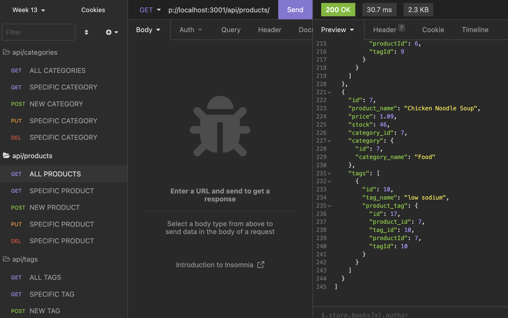

# e-commerce-backend

## Mitchel Wachtel - mitchel.wachtel@gmail.com

---

### Description

This app allows an e-commerce site to build its database of products, categories, and tags. Includes the routes to GET, POST, PUT, and DELETE so that the data can be accessed, modified, deleted, and created. In addition, the categories and products are linked as the products and tags. Because of these relationships, lots of relevant data can be retrieved, created, updated, and deleted from the database with very single queries.

---

### Table of contents

- [Installation](#installation)
- [Technology](#technology)
- [Usage](#usage)
- [License](#license)
- [Contributing](#contributing)
- [Tests](#tests)
- [Questions](#questions)

---

### Installation

To install the dependencies necessary to run use the application, the user should run the following command first:

`npm i`

---

### Technology

Technologies used: MySQL, node.js, npm, dependencies: 'sequelize', 'mysql2', and VS Code.

---

### Usage

After installing dependencies, the schema should be created via MySQL shell using `source db/schema.sql;`. The database should be seeded using `npm run seed` after exited the mysql shell in the terminal. Then the server should be started using `npm start`.

Watch _[this video](https://youtu.be/MOGrwByliH0)_ to see the how using this app works.

---

---

---

### License

Read more about the MIT License _[here](https://opensource.org/licenses/MIT)_.

---

### Contributing

Please contact mitchel.wachtel@gmail.com if you have any desire to contribute to this project.

---

### Tests

No tests are currently set up for this application.

---

### Questions

If you have any questions, please send me an email at mitchel.wachtel@gmail.com and I'll be quick to get back to you! You can also open an issue on GitHub. Find me on GitHub at https://github.com/mitchelwachtel if you are interested in any of my other work.
